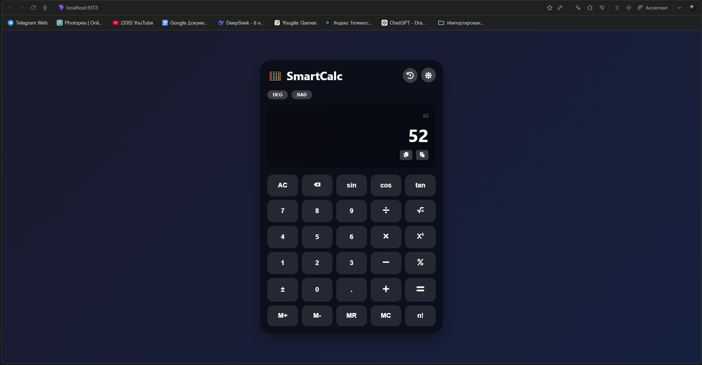
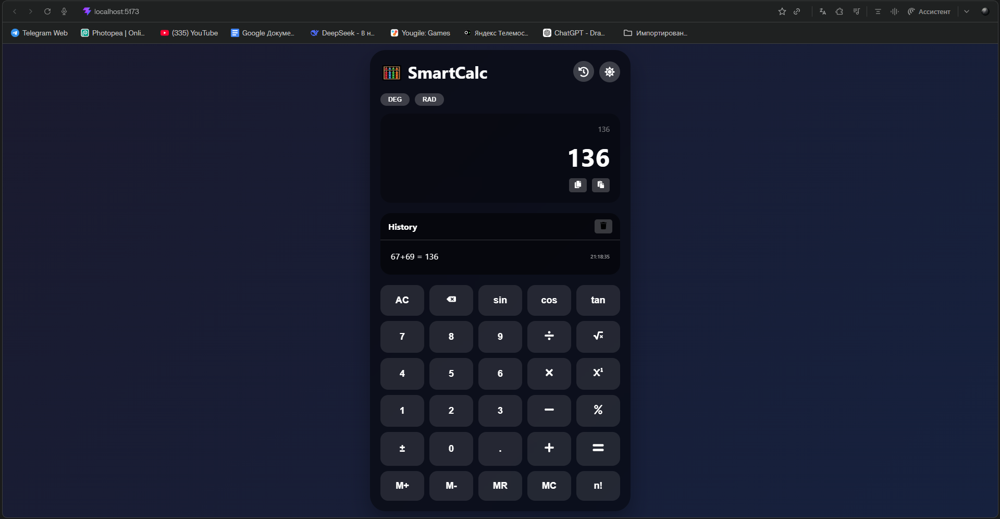
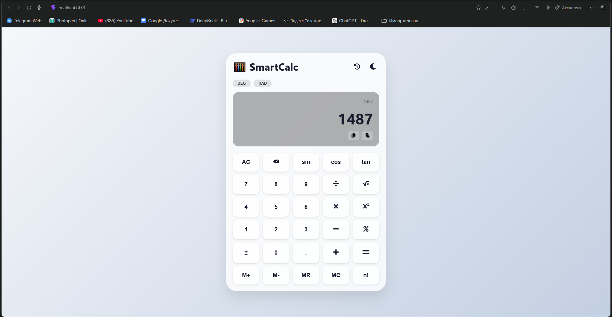
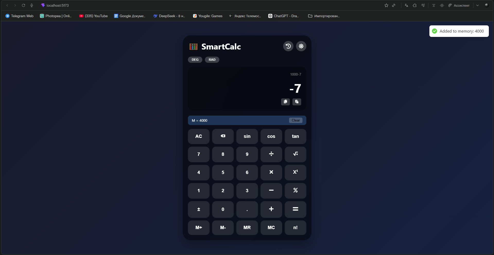

# 🧮 Smart Calculator

<div align="center">


**Modern calculator with scientific functions, memory, history and dark mode**

[📦 Installation](#-installation) | [🚀 Run](#-run) | [📖 Features](#-features) | [📸 Screenshots](#-screenshots)

</div>

---

## 📖 About

A feature-rich calculator application built with React and Vite. Includes basic arithmetic, scientific functions, memory storage, calculation history, and beautiful dark/light themes.

---

## ✨ Features

| Feature | Description |
|---------|-------------|
| ➕ Basic Operations | Addition, subtraction, multiplication, division |
| 📐 Trigonometry | sin, cos, tan with DEG/RAD modes |
| 📊 Power | Exponentiation (xʸ) |
| √ Square Root | Calculate square root |
| % Percentage | Percentage calculations |
| ± Sign Toggle | Positive/Negative numbers |
| n! Factorial | Calculate factorial |
| 💾 Memory | M+, M-, MR, MC functions |
| 📜 History | Saves all calculations |
| 📋 Copy/Paste | Copy results to clipboard |
| 🌓 Dark/Light Theme | Toggle between themes |
| ⌨️ Keyboard Support | Use keyboard for input |

---

## 🛠️ Tech Stack

- **React 18** - UI Framework
- **Vite** - Build Tool
- **Framer Motion** - Animations
- **React Icons** - Icons
- **React Hot Toast** - Notifications
- **Math.js** - Expression evaluation

---

## 📦 Installation

### Prerequisites

- **Node.js** (v18 or higher) - [Download](https://nodejs.org/)

### Step 1: Create project

```bash
npm create vite@latest calculator-app -- --template react
cd calculator-app
```

### Step 2: Install dependencies

```bash
npm install
npm install react-hot-toast framer-motion react-icons mathjs
```

### Step 3: Copy source files

Replace the contents of these files with the provided code:

- `src/App.jsx`
- `src/App.css`
- `src/main.jsx`
- `src/index.css`

---

## 🚀 Run

```bash
npm run dev
```

Open http://localhost:5173/ in your browser.

---

## 🎯 Usage

### Basic Operations

- Click number buttons to enter digits.
- Click operation buttons (+, -, ×, ÷).
- Press `=` or `Enter` to calculate.

### Scientific Functions

- `sin` / `cos` / `tan` - Trigonometric functions.
- `DEG` / `RAD` - Switch angle mode.
- `√` - Square root.
- `xʸ` - Power (exponentiation).
- `n!` - Factorial.
- `%` - Percentage.

### Memory Functions

- `M+` - Add to memory.
- `M-` - Subtract from memory.
- `MR` - Recall from memory.
- `MC` - Clear memory.

### History

- Click 📜 icon to show history.
- Click any history item to load result.
- Click 🗑️ to clear history.

### Copy/Paste

- Click 📋 icon to copy result.
- Click 📄 icon to paste number.

### Theme

- Click 🌙/☀️ button to toggle dark/light mode.

### Keyboard Support

| Keyboard Key | Action |
|--------------|--------|
| 0-9 | Numbers |
| . | Decimal point |
| + | Addition |
| - | Subtraction |
| * | Multiplication |
| / | Division |
| Enter or = | Calculate |
| Escape | Clear all (AC) |
| Backspace | Delete last character |

---

## 📸 Screenshots

<div align="center">
  
  
  
  
</div>

---

## ⚙️ Available Scripts

| Command | Description |
|---------|-------------|
| `npm run dev` | Start development server |
| `npm run build` | Build for production |
| `npm run preview` | Preview production build |

---

## 🐛 Troubleshooting

| Problem | Solution |
|---------|----------|
| Blank page | Check that all files are created correctly |
| Missing icons | Reinstall react-icons: `npm install react-icons` |
| Math errors | Ensure mathjs is installed: `npm install mathjs` |
| Port in use | Run `npm run dev -- --port 3000` |
| History not saving | Check browser localStorage permissions |

---

## 📦 Dependencies

```json
{
  "react": "^18.2.0",
  "react-dom": "^18.2.0",
  "react-hot-toast": "^2.4.0",
  "framer-motion": "^10.16.0",
  "react-icons": "^4.11.0",
  "mathjs": "^11.0.0"
}
```

---

## 🔧 Customization

### Change default theme

Edit `src/App.jsx`:

```javascript
const [darkMode, setDarkMode] = useState(false); // Start with light mode
```

### Change history limit

Edit `src/App.jsx`:

```javascript
localStorage.setItem('calc_history', JSON.stringify(history.slice(0, 100))); // Save 100 items
```

---

## 📱 Responsive Design

| Breakpoint | Layout |
|------------|--------|
| > 500px | Full grid (5 columns) |
| < 500px | Compact buttons |
| < 400px | Smaller padding |

---

## 🙏 Acknowledgments

- [React](https://reactjs.org/) for UI framework
- [Math.js](https://mathjs.org/) for expression evaluation
- [React Icons](https://react-icons.github.io/react-icons/) for beautiful icons
- [Framer Motion](https://www.framer.com/motion/) for smooth animations
